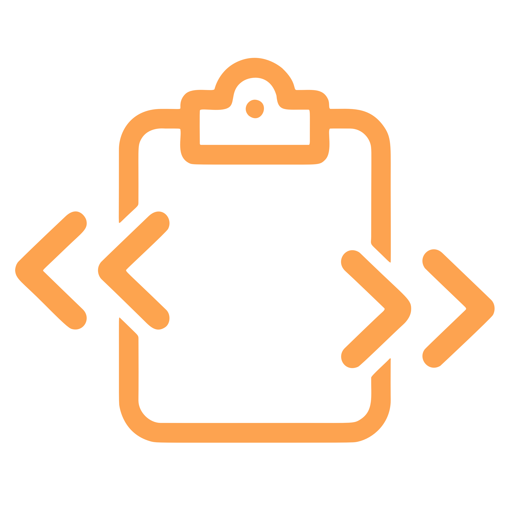

<p align="center">
  
</p>

<h1 align="center">RustClip</h1>

<p align="center">
  Self-hosted, end-to-end encrypted universal clipboard sync.<br />
  Pure Rust from the server to the desktop. One Docker image. One native menu-bar app.
</p>

<p align="center">
  <a href="https://github.com/advenimus/rust-clip/releases/latest">
    
  </a>
  <a href="https://github.com/advenimus/rust-clip/releases">
    
  </a>
  <a href="https://github.com/advenimus/rust-clip/actions/workflows/ci.yml">
    
  </a>
  <a href="https://github.com/advenimus/rust-clip/pkgs/container/rustclip-server">
    
  </a>
  
  
</p>

<!-- TODO: add a hero screenshot / animated GIF of a clip syncing between a Mac and a Windows machine. -->

---

## Why RustClip

Existing clipboard-sync tools split badly. ClipCascade is capable but a heavy Java/Spring stack. ClusterCut is lean Rust but LAN-only with no real internet story. Commercial options hold your content hostage behind an account on someone else's server.

**RustClip fills the middle:** one tiny Docker container, genuine end-to-end encryption, works across the public internet behind any reverse proxy, scales from a single user to a team or MSP without rework. The server routes ciphertext — it literally cannot read your clipboard.

---

## Features

### Universal clipboard

- **Text, images, and files** sync across macOS, Windows, and Linux.
- **Live** delivery over a single WebSocket per device — clips arrive within a second on healthy networks.
- **Offline queue** — copy something while your other device is off, it drains on reconnect.
- **Per-device local history** — last 100 items / 7 days, right in the tray. Click any entry to re-copy it without echoing back out.
- **Echo suppression** — sender-side device ID + content-hash LRU + post-write quiet window means you never see your own clips bounced back.

### End-to-end encryption

- **Your password is the key.** A content-encryption key is derived locally via **Argon2id** (`t=3, m=64 MiB, p=4`). It never leaves the device.
- **Every payload is sealed with XChaCha20-Poly1305** using a fresh 192-bit random nonce. AAD binds the source device, mime hint, and timestamp into the tag so the server can't re-label events.
- **Server stores ciphertext only.** A malicious operator with disk access gets bytes they can't decrypt — including the offline queue and blob storage.
- **Device tokens are hashed server-side** (subtle-time-safe compare) and revocable from the admin portal at any time.

### Native desktop app

- **Tauri v2**, signed and notarized on macOS, per-platform installers for Windows and Linux. No Electron bloat — the binary is a handful of MB.
- **Menu-bar only on macOS.** No dock tile, no application menu — tray icon is the entire surface and keeps the sync daemon alive.
- **Tray menu** — status (`Connected · user`), last 10 text clips as one-click re-copies, Account / History shortcuts, Start/Stop sync, About, Quit.
- **Toast notifications** for incoming clips from your other devices.
- **Auto-start on login** (toggleable per device).
- **Single keychain item** — all credentials packed into one encrypted blob so macOS raises one ACL prompt per session, not one per field.

### Admin portal

- **Bootstraps from env vars** on first startup (`RUSTCLIP_ADMIN_USERNAME` + `RUSTCLIP_ADMIN_PASSWORD`). Subsequent restarts ignore them — no accidental overwrites.
- **User + device management** — create users, hand out single-use enrollment tokens, revoke devices, reset passwords.
- **Audit log** with event-type + date-range filters, CSV export.
- **Runtime settings** live-editable from the web UI (max payload size, offline TTL, audit retention).
- **Overview dashboard** — user/device/clip counts, blob storage usage, recent activity.
- **Askama templates + HTMX.** Zero build step, tiny surface, server-rendered. Works without JavaScript for the critical paths.

### Production ops

- **One binary, one Docker image** — distroless, nonroot, ~30 MB final size.
- **SQLite in WAL mode** — one volume, one file, no extra container. Upgrade path to Postgres is mechanical if it ever matters.
- **Rate limiting** — token-bucket on auth endpoints + per-WS-connection event cap (30 clips / 10 s). Blob uploads and admin actions are deliberately not throttled.
- **Graceful shutdown** — SIGTERM drains in-flight connections, checkpoints WAL, closes the pool.
- **Prometheus `/metrics`** — hand-rolled counters + gauges, text format.
- **Structured logs** — JSON via `RUSTCLIP_LOG_FORMAT=json`, pretty in dev.
- **Security headers** — CSP, Referrer-Policy, X-Frame-Options, X-Content-Type-Options on every admin response.

---

<!-- TODO: screenshots section
  - admin portal overview
  - users + enrollment token flow
  - tray menu open with recent clips
  - account window
  - history window
-->

## Install

### Server (Docker)

```bash
# Pull the image
docker pull ghcr.io/advenimus/rustclip-server:latest

# Or use the included compose file (SQLite volume at ./data)
git clone https://github.com/advenimus/rust-clip
cd rust-clip
cp .env.example .env               # edit admin credentials + public URL
docker compose -f docker/docker-compose.yml up -d
```

Point your reverse proxy of choice (Caddy, Traefik, Nginx) at `http://container:8080`. Terminate TLS there — the server speaks plain HTTP on loopback.

### Desktop client

Grab the installer for your OS from the [latest release](https://github.com/advenimus/rust-clip/releases/latest):

| Platform | Download |
|---|---|
| **macOS** (Apple Silicon) | `RustClip_<version>_aarch64.dmg` — signed + notarized, opens cleanly |
| **Windows** (x64) | `RustClip_<version>_x64-setup.exe` (NSIS) or `_x64_en-US.msi` |
| **Linux** (x86_64) | `RustClip_<version>_amd64.AppImage` · `_amd64.deb` · `-1.x86_64.rpm` |

Each release also ships a headless **`rustclip-cli`** archive if you want to script it from a terminal.

### First-time enrollment

1. Log into the admin portal at `https://clip.example.com/admin` and create a user — copy the one-time enrollment token.
2. Open the desktop app, click **Account**, paste the server URL + enrollment token, and choose a password.
3. Repeat on every other device using the same account's password via the **Login** tab (the admin doesn't hand out enrollment tokens more than once unless you ask them to reset it).

---

## How it works

```
┌─────────────────────────────────────────────────────────────┐
│  Desktop client (Tauri · macOS/Windows/Linux)               │
│  clipboard watcher → crypto (content key, client-held) ─┐   │
│                                      │                  │   │
│                           local SQLite history ◄────────┘   │
└─────────────────────────────┬───────────────────────────────┘
                              │ TLS (reverse proxy)
                              ▼
┌─────────────────────────────────────────────────────────────┐
│  rustclip-server (Rust · axum · ~30 MB image)               │
│  REST auth · WS hub · Admin UI · Audit · Blob store         │
│                       │                                     │
│                       ▼                                     │
│              SQLite (WAL) + blobs/ on disk                  │
└─────────────────────────────────────────────────────────────┘
```

- **Inline vs blob:** clips ≤ 64 KiB ride inline over the WebSocket. Anything larger is uploaded via REST to `/api/v1/blobs`, then announced through the WS so peers can pull it.
- **Per-device delivery tracking:** a `clip_deliveries` table keeps per-device drain state. When a device reconnects it gets a backlog, framed with `BacklogStart` / `BacklogEnd` markers, and the server marks entries delivered as it goes.
- **Content key ≠ auth hash.** Server stores an Argon2id PHC string for login. The *content* key is a separate Argon2id derivation with a per-user salt, and it never crosses the wire.

For the full protocol, schema, and threat model, see [`docs/threat-model.md`](docs/threat-model.md) and [`CLAUDE.md`](CLAUDE.md).

---

## Build from source

```bash
git clone https://github.com/advenimus/rust-clip
cd rust-clip

# Run the server
RUSTCLIP_ADMIN_USERNAME=admin RUSTCLIP_ADMIN_PASSWORD=please-change-me \
  cargo run -p rustclip-server

# Run the desktop GUI
cargo run -p rustclip-client-gui

# Run the CLI
cargo run -p rustclip-client -- enroll --server-url http://127.0.0.1:8080
```

Checks:

```bash
cargo fmt --all --check
cargo clippy --workspace --all-targets -- -D warnings
cargo test --workspace
```

Rust **1.88+** (pinned in `rust-toolchain.toml`).

---

## Roadmap

**In progress**

- **Self-updater** in the desktop app — check GitHub releases, notify the user, one-click update.

**Planned**

- Linux file-copy detection. macOS + Windows auto-sync Finder/Explorer copies today; Linux still relies on the `send-files` CLI because arboard exposes no file-list reader and the GNOME/KDE/X11/Wayland surface is fragmented.
- Windows code-signing (macOS already signed + notarized).
- Optional "require password on unlock" mode that purges the content key from memory between sessions.
- Linux `aarch64` client build.
- Multi-arch Docker image (`linux/arm64`).

**Known deferrals**

- `docs/architectural_decisions.md` and `CLAUDE.md` track design deviations and deferrals. OPAQUE / SRP login and Postgres backend are noted as v2 upgrade paths.

---

## Security posture

- The server sees your password in cleartext **during login only** (over TLS). It's then hashed with Argon2id for storage. Devices never re-send the password after enrollment — they hold the device token and the derived content key. This is the standard web-login posture; OPAQUE / SRP is a documented v2 path if the threat model tightens.
- Ciphertext blobs at rest are **not** separately encrypted at the filesystem layer. Run the container on an encrypted volume if disk seizure is part of your threat model.
- See [`docs/threat-model.md`](docs/threat-model.md) for the full list of what's guaranteed and what isn't.

Found a security issue? Please open a private advisory on the repo rather than a public issue.

---

## Credits

Designed and built by **Chris Vautour** ([@advenimus](https://github.com/advenimus)) with a strong opinion about what clipboard sync should look like.

Heavy lifting by the Rust ecosystem — `axum`, `tokio`, `sqlx`, `tauri`, `arboard`, `argon2`, `chacha20poly1305`, `askama`, and a long tail of crates listed in `Cargo.toml`.

## License

RustClip is released under the [PolyForm Noncommercial License 1.0.0](LICENSE.md).

**You may use RustClip freely for:**

- Personal and hobby use (self-hosting for your own devices, home networks, side projects).
- Research, academic, and educational use.
- Use by charitable, nonprofit, public-research, public-safety, environmental, and government organizations.

**Commercial use requires a separate commercial license**, including:

- Running RustClip internally at a for-profit company.
- Offering RustClip (or a modified version) as a hosted / managed service.
- Redistributing RustClip as part of a product sold to customers.

A paid hosted RustClip service, run by the maintainer with self-service management for teams and businesses, is planned. If you need commercial terms in the meantime, open a conversation via the repository.

The full legal text is in [LICENSE.md](LICENSE.md). For the short human-readable summary of the PolyForm Project's noncommercial terms, see <https://polyformproject.org/licenses/noncommercial/1.0.0/>.
